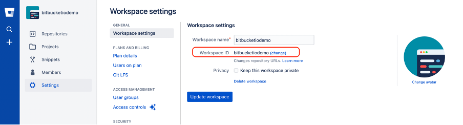

<!-- .slide: data-background-image="images/bg-mouse.jpg" -->
# Skill Up: Code

<!-- .slide: data-background-image="images/bg-mouse.jpg" data-audio-src="audio/atom-intro.ogg" -->
## Visual Code Studio Editor

Note:
For this course we're going to use Visual Code Studio. There are a lot of different text editors available and lots are people are pretty dedicated to their favourite. However Visual Code Studio (VCS) provides a lot of support, such as spelling consistency (undefined variables) and structure.

<!-- .slide: data-background-image="images/bg-mouse.jpg" data-audio-src="audio/atom-why.ogg" -->
### Why use VCS
* Cross platform
* Configurable (HTML & CSS)
* Easy to setup and learn
* Package manager for plugins
* Cool features
	* Syntax highlighting
	* Smart autocomplete
	* Search and browse project files
	* Git integration

<!-- .slide: data-background-image="images/bg-mouse.jpg" -->
<video>
	<source data-src="videos/vcs-intro.webm " type="video/webm" />
</video>

<!-- .slide: data-background-image="images/bg-mouse.jpg" -->
### VCS: Activity
* Install VCS
* Open VCS and add the document you made before class as a project
* Explore VCS features
	* Open settings menu 
	* Explore features in the command palette 
	* Explore keyboard shortcuts 

<!-- .slide: data-background-image="images/bg-mouse.jpg" -->
Share what you found

<!-- .slide: data-background-image="images/bg-mouse.jpg" -->
### VCS plugins
* Open the extensions on LH menu  and select install
* Type in the support you want

<!-- .slide: data-background-image="images/bg-mouse.jpg" -->
## Git on Bitbucket

<!-- .slide: data-background-image="images/bg-mouse.jpg" data-audio-src="audio/git-what.ogg" -->
### What is git
* Source control
* Version control
* Distributed

Note:
Bitbucket is a distributed source and version control platform that uses git software. It tracks changes to our files and stores those changes on a server.

<!-- .slide: data-background-image="images/bg-mouse.jpg" data-audio-src="audio/git-why.ogg" -->
### Why use git
* Store and share source code
* Tracks changes and versions over time
	* Can go back if we broke something
* Allows multiple people to work on the same code without disrupting eachother
* Share our site as a public link to bitbucket.io!

Note:
Tracking our code changes on Bitbucket makes it easy to share and prevents us from trying to manage multiple versions when we're trying something new. If you broke something, you can just revert your code back to an earlier state. Because it stores changes, instead of the whole file, it also makes it easier for multiple people to work on the same code without breaking each other's work.

<!-- .slide: data-background-image="images/bg-mouse.jpg" data-audio-src="audio/git-functions.ogg" -->
### Git functions on Bitbucket
* Clone - Copy a repository to our local machine
* Add - Stage a file to commit
* Commit - Store a code change in git
* Push - send our code changes to the server
* Fetch - Get code from the server
* Merge - Mix new code in with ours or vice versa
* Pull - Fetch and Merge together
* Rebase - Like merge but different

Note:
This are some common git functions. Don't worry, you don't need to learn them all now. 

<!-- .slide: data-background-image="images/bg-mouse.jpg" data-audio-src="audio/git-github.ogg" -->
### Bitbucket
* A commercial git server as part of Atlassian suite of development tools
* A place to publish and share your code
* A place to find and download code other people have written
* A platform to submit code changes to open source projects

Note:
Bitbucket is a commercially popular server. We're going to use it in this course to track our projects. It is linked to the issue tracking Tool Jira and a document Wiki Confluence

<!-- .slide: data-background-image="images/bg-mouse.jpg" -->
### Activity: Setup a git repository

* So now: Register for Bitbucket with your CDU email. Make sure you monitor this email.
* Then setup you ssh key for access (esp when using visual support tools like SourecTree or GIT GUI)[https://support.atlassian.com/bitbucket-cloud/docs/set-up-an-ssh-key/](Support)
* Create a new repository for your preparation for the unit

Note: 
If you prefer to use github, that's okay, but more instructions will be for bitbucket. The main difference is Bitbucket is used for commercial applications more and has more security

<!-- .slide: data-background-image="images/bg-mouse.jpg" data-audio-src="audio/git-wingit.ogg" -->
### Git client
* There are lots of clients available
* Download WinGit from [https://git-scm.com/download](https://git-scm.com/download)
* GUI with SourceTree [https://www.sourcetreeapp.com/](https://www.sourcetreeapp.com/) and command prompt with Git Bash

Note:
There are a lot of git clients about. For those of you on windows, I'd suggest using Git GUI for windows or the git client built in to Visual Code Studio

<!-- .slide: data-background-image="images/bg-mouse.jpg" data-audio-src="audio/git-clone.ogg" -->
#### Create a Repository
* Select the '+' button
 
* In bitbucket the repository is default private, so unselect that. 
* Choose a workspace name that will be unique to you . 
* Include a README and a .gitignore file

<!-- .slide: data-background-image="images/bg-mouse.jpg" data-audio-src="audio/git-clone.ogg" -->
#### Name a Repository

* You only need to make one repository per project, so spend some time on setting it up

<!-- .slide: data-background-image="images/bg-mouse.jpg" data-audio-src="audio/git-clone.ogg" -->
#### .gitignore
* .gitgnore is a file that tells the repository not to store various files. For instance images are not text based so cannot be version controlled. 
* However until you share images amongst your teams, better to include in your repository (so remove image references from your .gitignore)
* If your files are not pushing (see below) then they are probably in the .gitignore

<!-- .slide: data-background-image="images/bg-mouse.jpg" data-audio-src="audio/git-clone.ogg" -->
#### Clone a repository
 
* Change from SSH to HTTPS connection
 

<!-- .slide: data-background-image="images/bg-mouse.jpg" data-audio-src="audio/git-merge.ogg" -->
#### Using Sourcetree

* Select the directory to copy the code. Please make a subject folder to put this in, organise your work
* You can then edit your code in your code editor. When you make changes, commit them through Sourcetree and push to the repository online

<!-- .slide: data-background-image="images/bg-mouse.jpg" data-audio-src="audio/git-merge.ogg" -->
#### Using Sourcetree
Sourcetree has very good interface to see past changes, files changes to commit, and notification of items from team members to pull

<!-- .slide: data-background-image="images/bg-mouse.jpg" data-audio-src="audio/git-merge.ogg" -->
#### Using VS CODE
* Open VS Code in a new workplace and select the tree icon on left hand menu to do basic commit, and push

<!-- .slide: data-background-image="images/bg-mouse.jpg" data-audio-src="audio/git-merge.ogg" -->
#### Sharing Repository

* Without access to write, your team will have to make a pull request, this is not productive.
* Use Settings on left hand menu to add users or change  to public under Repository Settings

  

<!-- .slide: data-background-image="images/bg-mouse.jpg" data-audio-src="audio/git-commit.ogg" -->
### Commit and Push

* If another team member has been editing the same file as you, you will not be able to push you changes. You will get a message
 

<!-- .slide: data-background-image="images/bg-mouse.jpg" data-audio-src="audio/git-commit.ogg" -->
### Commit and Push

* To continue your work, 
* a.	pull their changes 
* b.	merge with the new head you just downloaded
 

<!-- .slide: data-background-image="images/bg-mouse.jpg" data-audio-src="audio/git-merge.ogg" -->
#### Fetch changes

* To get the latests changes from the server select "Pull". This downloads the latests changes from the server. 
* Select manually how you will edit the differences between the files using your code editor
* Commit and Push the new changes

<!-- .slide: data-background-image="images/bg-mouse.jpg" -->
### Activity: Bitbucket local repository
* Clone your repository to your local machine
	* You can get the address from the green clone button on github
* Copy your prep for unit site to the directory
* Add the new files to git
* Commit the staged files with the comment "add initial files"
* Push your code and check it appears on the Bitbucket website

<!-- .slide: data-background-image="images/bg-mouse.jpg" -->
### Some tips
* Fetch from the server before you start writing
* Push whenever you finish writing
* A commit should be self-contained
	* If you are editing multiple files, include them all
	* Keep them small so it is easy to see what has changed
	* It is better to commit too frequently rather than not enough
	* Try not to break things
* If you get access errors, make sure you have your ssh key set up

<!-- .slide: data-background-image="images/bg-mouse.jpg" -->
## Set up your site

* How to create a repository with the full name: <workspace_ID>.bitbucket.io
* Step 1: Go to workspaces page https://bitbucket.org/account/workspaces/ and select the workspace that you created for HIT226.

<!-- .slide: data-background-image="images/bg-mouse.jpg" -->
### Setting up your site

* Step 2: Select Settings 

<!-- .slide: data-background-image="images/bg-mouse.jpg" -->
### Setting up your site

* Step 3: Then you can modify your workspace ID and privacy settings 

<!-- .slide: data-background-image="images/bg-mouse.jpg" -->
## HTML Validation

<!-- .slide: data-background-image="images/bg-mouse.jpg" data-audio-src="audio/validate-why.ogg" -->
### Why validate
* Identify mistakes
	* Typos
	* Unclosed tags
	* Missing doctype
	* Weird stuff

Note:
If you make a mistake in your HTML the browser will guess what you were trying to do and show that. This means that sometimes you don’t notice if you forgot to close a tag or used an invalid property. Unfortunately, because the browsers guess what they think you’re trying to do it might not be what you intended and might not work the same in all browsers. To address this we can validate our HTML.

<!-- .slide: data-background-image="images/bg-mouse.jpg" data-audio-src="audio/validate-demo.ogg" -->
<video>
	<source data-src="videos/html-validator.webm" type="video/webm" />
</video>

Note:
Here I'm validating my HTML using the W3C validator. You can see I've made some mistakes. I accidently included an extra < in an img tag and forgot to close some tags

<!-- .slide: data-background-image="images/bg-mouse.jpg" -->
### Validation Exercise
* Visit [https://validator.w3.org/](https://validator.w3.org/)
* Validate your page by direct input
* Fix any issues you can
* Commit you changes to github with a meaningful commit message
* Discuss what you found

<!-- .slide: data-background-image="images/bg-mouse.jpg" data-audio-src="audio/semantic-intro.ogg" -->
## Semantic HTML
* HTML describes the structure of the page <!-- .element: class="fragment" data-fragment-index="1" -->
* Semantic HTML adds meanining <!-- .element: class="fragment" data-fragment-index="1" -->
* Not about look and feel <!-- .element: class="fragment" data-fragment-index="1" -->

Note:
HTML represents the content and structure of a page. We spend so much time thinking about what the page looks like that we sometimes forget this. But when writing HTML we shouldn’t be thinking about the visual layout so much as the structural layout.

<!-- .slide: data-background-image="images/bg-mouse.jpg" data-audio-src="audio/semantic-why.ogg" -->
### Why do semantics matter
* Bots and SEO
* Vision impaired users
* People with arthritis
* Someone eating a sandwich
* Developers picking up your code (you)

Note:
Not everyone looks at a page as we see it rendered. Just as not everyone navigates it with a keyboard and a mouse. A well structured page pages it easier to parse and navigate for all users. Some examples of users we might want to consider.

<!-- .slide: data-background-image="images/bg-mouse.jpg" data-audio-src="audio/semantic-elements-old.ogg" -->
### Semantic elements
Describe what is in the tag
* form
* img
* table
* ul

Note:
Semantic elements describe what sort of data is in the element. Some you might have seen include the form element, which says this is an input form, the image element which describes an image, table elements which tell us we're looking at tabular data and a ul element which describes a list of items where the order does not matter.

<!-- .slide: data-background-image="images/bg-mouse.jpg" data-audio-src="audio/semantic-elements-html5.ogg" -->
### New HTML5 semantic elements
* header
* main
* footer
* nav
* section
* article

Note:
HTML5 bought us a lot of new semantic elements. The big changes are the structural elements that tells us where the content belongs in the page structure. What do you think these mean?

<!-- .slide: data-background-image="images/bg-mouse.jpg" -->
### Semantics Activity
* Have a look at the element list at [https://developer.mozilla.org/en-US/docs/Web/Guide/HTML/Content_categories#Flow_content](https://developer.mozilla.org/en-US/docs/Web/Guide/HTML/Content_categories#Flow_content)
* Look at the flowchart at [http://html5doctor.com/downloads/h5d-sectioning-flowchart.png](http://html5doctor.com/downloads/h5d-sectioning-flowchart.png)
* Update your HTML to use the new semantic elements

<!-- .slide: data-background-image="images/bg-mouse.jpg" -->
### Questions
* When do you think you should use a div element?
* How should you name a new section?
* What do you think about the new semantic elements?
	* Too many
	* Not enouch
	* Too confusing?

<!-- .slide: data-background-image="images/bg-mouse.jpg" -->
### Final thoughs
<blockquote cite="http://html5doctor.com/lets-talk-about-semantics/">
	
Don&#39;t think of &lt;article&gt; as a magazine article. Think of it as an article of clothing, an independent entity that can be arranged in conjunction with other articles of clothing, but is a complete thing in itself.

	<footer><a href="http://html5doctor.com/lets-talk-about-semantics/">Bruce Lawson</a></footer>
</blockquote>

<!-- .slide: data-background-image="images/bg-mouse.jpg" -->
## Final Activity
* Update your site to include semantic elements
* Commit your changes to git with the message "Use semantic elements"
* Run your code through the [W3C validator](https://validator.w3.org/) again
